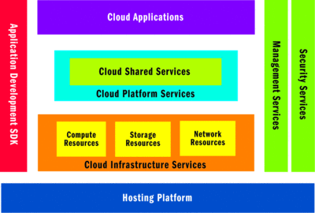

#Design and implement applications for scale and resilience

##Select a Pattern
  * A cloud computing platform enables applications to be hosted in an __Internet-accessible virtual environment__ that supplies the necessary hardware, software, network, and storage capacities and provides for security and reliability, removing much of the burden of purchasing and maintaining hardware and software in-house. Pay for only what you use. 
  * Typical cloud platform: 
  * __Infrastructure as a Service (IaaS)__: gain access to the underlying physical resources without knowing the details of the underlying hardware and software and can control these systems efficiently through configuration.
  * Applications expose Web interfaces and Web Services for end users, enabling multitenant hosting models. Some functions include connecting disparate systems and leveraging cloud storage infrastructure to store documents. These services fall under the umbrella of Software as a Service (SaaS).
  * A common Windows fabric __abstracts the physical hardware and software platform and exposes virtualized compute and storage resources__.
  * Each instance of the application is monitored for availability and scalability, and automatically managed.
  * __Compute Patterns__: When planning your compute tasks is to remember to execute those tasks in such a way as to avoid moving large amounts of data around. (Worker role/WebJob).
  * __Storate Patterns__: Remote storage and abstracts the storage medium away from the users. The __table storage__ pattern allows the applications to store key/value pairs following a table structure while the __blob storage__ pattern can be used to store any data (mainly files).
  * __Communication Patterns__: message exchange (WCF, REST). Stateless applications.
  * __Management Patterns__: service deployment to organize service definition, configuration and monitoring. __Service level agreement__.
  *  Inter-role communication (between services) is enabled through a Queue service, which provides an asynchronous message exchange. Storage services are exposed through REST-style interfaces for easier consumption by other applications and cloud providers.
  * Links
      - [Patterns For High Availability, Scalability, And Computing Power With Microsoft Azure](https://msdn.microsoft.com/en-us/magazine/dd727504.aspx)

###Left off at a real world example^

##Implement transient fault handling for services
  * Links

##Respond to throttling
  * Links

##Disable Application Request Routing (ARR) affinity
  * Links